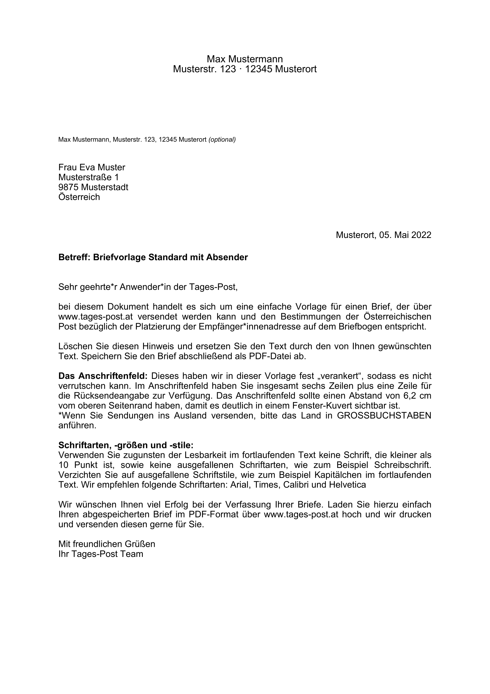

<meta name='keywords' content='Austria, Österreich, Post AG, Brief, letter, template, reportlab, python'>

# Austrian Post Letter Template

## Description

This tool aims to fill variables (of a given dataset input) into the Austrian [Post AG - Vorlage mit Absender](https://www.einfach-brief.at/fe/assets/files/EinfachBrief-Vorlage-Musterbrief_Standard_mit_Absender.docx) letter template using ReportLab library in Python and save it as a .pdf file. The main features are:

- Create a .pdf letter in A4 respecting the [letter design settings](https://www.einfach-brief.at/fe/vorlagen) defined by the Post AG.
- Iteration to create a .pdf with multiple pages (one letter per page), taking recipients from a given dataframe (an example is provided in the [at-post-letter-template.py](at-post-letter-template.py) code).
- Fully personalizable: each text block is divided into frames; for each frame, it is possible to change the font and font size, add boundary to the text frames, change text colors, etc. Also specific words/sentences can be formatted (bold, italic, etc.) using simple HTML.

## Output

<p align="center">

</p>

# Usage

## Python dependencies

```.ps1
python -m pip install pandas reportlab
```


# Documentation

[Post AG Österreich - Briefgestaltung](https://www.einfach-brief.at/fe/vorlagen)
